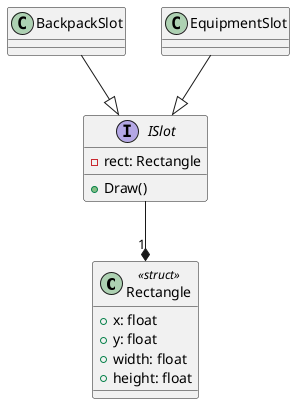

# My Diagrams

Here's an example PlantUML diagram:

```puml
@startuml

class Rectangle <<struct>> {
    + x: float
    + y: float
    + width: float
    + height: float
}

interface ISlot {
    + Draw()
    - rect: Rectangle 
}

class BackpackSlot {}
class EquipmentSlot {}

ISlot --* "1" Rectangle
BackpackSlot --|> ISlot
EquipmentSlot --|> ISlot

@enduml
```
